## Introduction ##

**FieldTracer** is an Android application that makes it easy to **acquire GPS traces and Point of Interest after a disaster situation**. Even with no relying infrastructure, FieldTracer allows a team to automate the sharing of traces between them. It also provides offline background maps.

Finally those traces can be uploaded to OpenStreetMap to be reviewed.

## Architecture ##

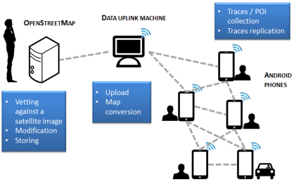

## Screenshots ##
###Home
At first the application proposes you to pre activate the GPS sensor. This can be useful when there is no mobile reception, the sensor cannot use the Assisted-GPS and thus takes up to 5 minutes to find a signal.

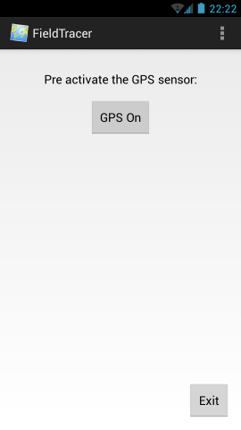

The signal is then acquired and an user can start to trace or to note Point of Interests.

As shown in the menu, the application is divided in 4 activities:

- A **GPS tracing** activity to record in GPX or in plain text
- A **traces sharing** and POI sharing activity that uses Serval Rhizome and from where an user can set automated sharing preferences
- A **tools** activity to show all the maps in the network and locally and to download one map
- A **settings** activity to set which recording format and which background map the application should use

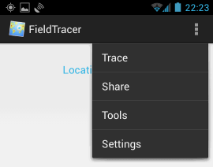

###Trace
In the GPS tracing screen, an user can record a Point of Interest, and start recording a trace using the Toggle button.
It is also possible to display the last recorded trace from the menu.

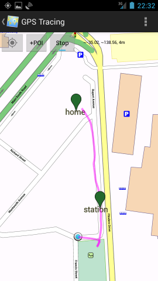

When adding a Point of Interest, an user can specify **which type and name** should be used. The POI will then be displayed.

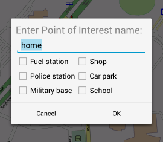

It works in the same way for the traces.

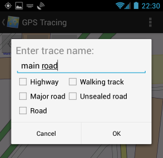

###Share
Under the share screen it is possible to set **automated sharing** of traces and POI. They will then be automatically spread in the mesh network using Serval.

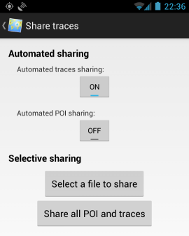

### Tools
Under the tools screen it is possible to download a background map from the mesh

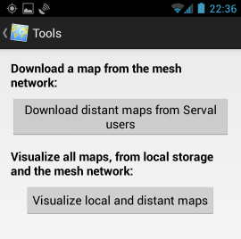

It is possible to visualize the background maps from the mesh network and from the local storage. This can be used for instance to know which map should be downloaded.

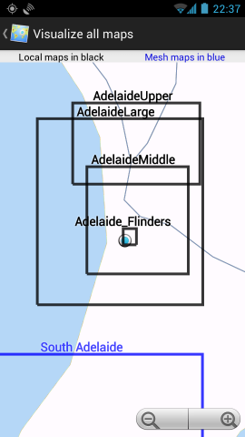

### Settings
It is possible to specify the background map used for tracing and which format should be used for traces (GPX or Text)

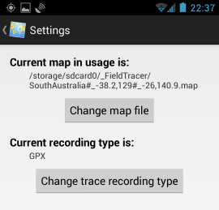

##The Serval Project and Mapsforge##

###Serval
The application uses the Serval Mesh for sharing and getting data from a mesh between multiple phones. Serval can actually not only uses a mesh configuration but also a base-station <-> clients network.

See [http://www.servalproject.org/](http://www.servalproject.org/)

###Mapsforge
The application uses the Mapsforge library to display background maps without having to pull them from Internet.

See [https://code.google.com/p/mapsforge/](https://code.google.com/p/mapsforge/)

##Software stack used
When diffusing the traces within the team:

When uploading the traces to OpenStreetMap:

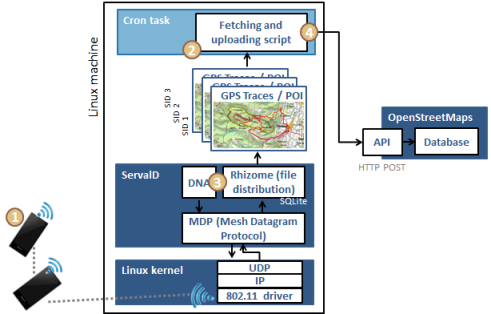

##Installation##

**On Android phones:**

1. Get the Serval Mesh application (Google Play: [https://play.google.com/store/apps/details?id=org.servalproject](https://play.google.com/store/apps/details?id=org.servalproject) )
2. Configure Serval Mesh with a phone number and a name
3. Download the git source code with `git clone https://github.com/LoicLWRT/FieldTracer.git`
4. Open the project under Eclipse or compile directly with `ant`
5. OR directly install the APK from [android_app/bin/FieldTracer.apk](android_app/bin/FieldTracer.apk)
6. Get a Mapsforge map of the zone you plan to trace from [http://download.bbbike.org/osm/](http://download.bbbike.org/osm/)
7. Copy the map to the `/sdcard/FieldTracer/` folder
8. You are ready to go :)

**For the OpenStreetMap traces uploader:**

1. Get the serval-dna source code with `git clone https://github.com/servalproject/serval-dna.git`
2. Configure it with
`autoreconf -f -i` then `./configure` and `make`
3. Get the script [https://github.com/LoicLWRT/FieldTracer/blob/master/unix_script/pushing_traces_to_OpenStreetMap.sh](https://github.com/LoicLWRT/FieldTracer/blob/master/unix_script/pushing_traces_to_OpenStreetMap.sh) and place it in the serval-dna folder
4. Configure and run the script to upload traces when one phone is connected to the Unix machine

##Future improvements##
- Core traces recording should be made as a service to improve continuous operation
- Mapsforge library could be migrated to the upcoming 0.4 when it is released
- Direct upload to OpenStreetMap from one mesh node without having to run the Unix script
- Automated creation of OpenStreetMap accounts linked to a SID to improve data separation between multiple team members
- Security assessment to prevent data tampering 
